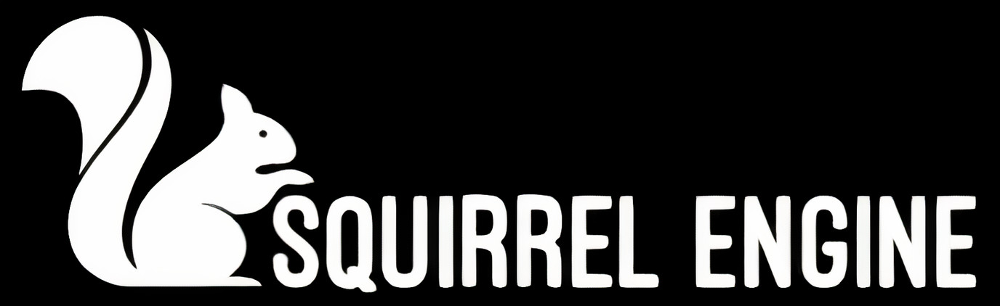
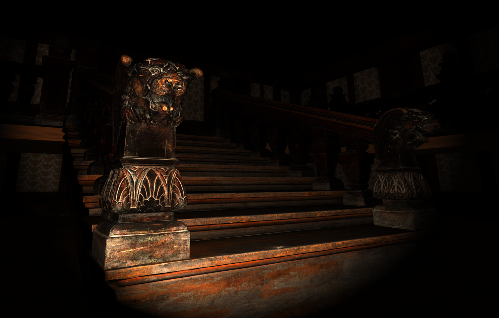
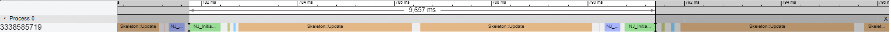
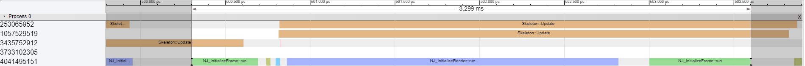

# Educational Purpose Multithreaded Game Engine

**The Squirrel Engine was created to set an example for an efficient multi-core game engine design.  It’s built for achieving maximum performance on high end pc devices**


## Features
- Multithreaded high performance, low overhead job system
- Lightweight, easy to use
- Fully operational Entity Component System
- Physically Based Rendering
- MSAA (Forward Anti-Aliasing), FXAA (Deferred Anti-Aliasing)
- Point, Directional and Spotlight Sources
- DirectSound supported audio engine
- Behavioral Tree and Blackboard based AI module

## Overview


```cpp
void Sandbox::Run()
{
//Set custom control schema
	auto testSchema = new TestControlSchema();
	getInterface<IP_Interface>().setControlSchema(testSchema);

//Create a actor via Camera class to make it a First Person Player
	auto Player = LevelStore::createActor<Camera>(EActorType::CAMERA, "Player");
	Player->lightComponent.setLightType(ELightType::SpotLight);

//Create a game object and set its transformation
	auto Statue = LevelStore::createActor<Skeleton>(EActorType::ACTOR, "Statue");
	Statue->transformComponent.setTransform(18, -3, 17);
	Statue->transformComponent.setScale(0.03, 0.03, 0.03);
	Statue->renderComponent.C_ShaderID = 0; //Shader
	Statue->renderComponent.C_ModelID = 2; //Model
	Statue->audioComponent.C_AudioSourceID = 0; //Audio Source

	auto Map = LevelStore::createActor<Skeleton>(EActorType::ACTOR, "Map");
	Map->transformComponent.setTransform(0, -5, 0);
	Map->transformComponent.setScale(0.05, 0.05, 0.05);
	Map->renderComponent.C_ShaderID = 0;
	Map->renderComponent.C_ModelID = 3;
	Map->audioComponent.C_AudioSourceID = 0;

//Add light sources to the scene
	auto FirstLight = LevelStore::createActor<Light>(EActorType::LIGHT, "FirstLight");
	FirstLight->transformComponent.setTransform(0, 5, 35);

	auto SecondLight = LevelStore::createActor<Light>(EActorType::LIGHT, "SecondLight");
	SecondLight->transformComponent.setTransform(0, 5, 0);
}
```

## Table of Contents

  * [Motivation](#motivation)
  * [How To Build](#how-to-build)
     * [Why CMAKE?](#why-cmake)
     * [CMAKE Build ](#cmake-build)
  * [Example game](#example-game)
  * [Building your first game](#building-your-first-game)
     * [Engine architecture overview](#engine-architecture-overview)
     * [Entity component system](#entity-component-system)
     * [How to import asset](#how-to-import-asset)
     * [How to add custom actors and components](#how-to-add-custom-actors-and-components)
     * [How to spawn actors](#how-to-spawn-actors)
  * [Important components](#important-components)
     * [Component 1: Transform](#component-1-transform)
     * [Component 2: Render](#component-2-render)
     * [Component 3: Camera](#component-3-camera)
     * [Component 4: Light](#component-4-light)
     * [Component 5: AI](#component-5-ai)
     * [Component 6: Audio](#component-6-audio)
  * [Conclusion](#conclusion)
  * [License](#license)

## Motivation
Games are an inseparable part of our lives in today’s world. With that, the human resources and money investment that is spent on game development increases every day. To keep up with that increase, a series of tools needed to automate and to make the game development processes easier.

First commercial game engines have democratized the game development processes. Thanks to those engines, thousands of games of different kinds were created in time. In addition to that, many tools are developed too. Game engines are one of the most comprehensive, complicated and sophisticated ones of these development tools.
	
 In time, technology has growt and people have developed multi-core processor architectures. So the aim of this project is to create a game engine that can work with multi-core processors. With achieve this, game development time costs will decrease and games will work more effectively on lower spec devices.

## How To Build
### Why CMAKE?
CMAKE is one of the best cross platform build system solutions available on the market. It allows you to build multi-platform builds in a robust format. Using CMAKE, you can very easily share your project between various development environments. As a team, we used VS throughout the development process, but the project can be up and run on CLion or Emacs within seconds. CMAKE comes with its own description language. It is similar in structure to make but adds extra commands for cross-platform compatibility. The build procedure of the projects is defined by CMAKE and it's automatic.

### CMAKE Build
```bash
mkdir build
cd build
cmake ..
start Squirrel.sln
```


## Example game

Squirrel Engine is a static library. The actual code is extracted from the library by the linker and used to build the final executable at the point you compile/build your application. It specified in the CMakeList file of Squirrel-Game that it's linked with the engine. You can add new actors to your scene, change their properties and interact by writing scripts using the interfaces and functions offered by the engine.

## Building your first game
Game development with the Squirrel Engine requires your C++ fundamentals. Basically, you  need to be familiar with variables, methods, OOP paradigms and templates. The paradigms for developing performance software have been pretty similar for 30 years, and the Squirrel Engine was built on these foundations. We wish a pleasant and comfortable development process for experienced developers.
### Engine architecture overview
Squirrel Engine is a game engine, so it is developed as a framework. Squirrel Engine is the result of many separately developed blocks combining together. It adheres to Domain Driven Design principle at the design stage. We created an engine with easily changeable and independent parts. Our graphic engine works with OpenGL and GLSL. For the game loop, we use a multi-core game loop architecture named “Job System” to make it work more efficiently for multi-core processors. We used the “Behavior Tree” system that is used in many popular systems for our AI system. To take an input, Squirrel Engine uses Win32 based infrastructure that is represented by GLFW. Even though we do not have an advanced sound system in Squirrel Engine v1.0 we developed a simple sound system that plays the sound via different threads for every actor.

The Squirrel Engine architecture contains multiple types of programming paradigms and languages. Engine consists of modules nested around a core. These modules are fully pluggable. When one is removed, and another suitable module is replaced, the rest of the system will not have any integration problems. In this approach, our aim was to establish a structure that would support agile software development processes. The Squirrel Engine core contains component based system, which we can call the core of the system. Apart from that, there are structures such as memory access controllers. Apart from that, another task of the core is to organize the healthy operation of other modules. System uses the code-base to add new scripts or write shaders.

The render engine is the basic module that controls how the graphic will appear. It includes various graphic algorithms and drawing mechanisms. Its purpose is to quickly render the draw calls sent to it. The speed of this process directly affects the FPS value the player will receive and is very critical. There is a mechanism inside the render engine that renders the draw calls required to render a frame. Since OpenGL can calculate only one drawing at a time, only one draw call is processed at the same time. Even if draw call production is done in a multi-core format, this is a barrier. To overcome this, graphic APIs with multi-core rendering capabilities can be preferred. Examples of these are DirectX12 and Vulkan.


### How to import asset
Squirrel Engine can import four different types of assets. Go and modify RM_Interface::loadAssetMap method.

Mesh
```cpp
meshAssetMap.insert({
0,                                // Index of the asset 
"../../Squirrel-Engine/res/models"// Path of the asset
 });
```

Texture
```cpp
textureAssetMap.insert({
0,                                  // Index of the asset 
"../../Squirrel-Engine/res/textures"// Path of the asset
 });
```

Audio
```cpp
audioAssetMap.insert({
0,                               // Index of the asset 
"../../Squirrel-Engine/res/audio"// Path of the asset
 });

```

Shader
```cpp
shaderAssetMap.insert({
0,                                 // Index of the asset 
"../../Squirrel-Engine/res/shaders"// Path of the asset
 });
```

### How to add custom actors and components
All actors and components should be derived from their own base classes. BeginPlay and Update functions should be implemented 
 
***Custom Actor  Sample***
```cpp
SR_ACTOR()
class ExampleActor : public Actor
{
public:
ExampleActor();

// Called when the game starts or when spawned
void BeginPlay() override;

// Called every frame
void Update() override;

SR_VAR_START()
// Variables goes here
SR_VAR_END()

SR_COMP_START()
// Components goes here 
SR_COMP_END()
};
SR_ACTOR()
```

***Custom Actor Component Sample***
```cpp
class ExampleComponent : public ActorComponent
{
public:

ExampleComponent();

// Called when the game starts or when spawned
void BeginPlay() override;

// Called every frame
void Update() override;

// Prepared component for simulation
void setup() override;

// Custom functions goes here

SR_VAR_START()
// Variables goes here
SR_VAR_END()
};
SR_COMPONENT()
```
***Actor and Component Binding***
 Bind a component, allows creating a child class and returning the parent class. This should goes in costructor
```cpp
ExampleActor::ExampleActor() //Constructor
{
bindComponent(&component);
}
```


### How to spawn actors

Allows you to spawn new actor. Squirrel Engine contains three diffrent type of actor
```cpp
auto Statue = LevelStore::createActor<ExampleActor>(EActorType::ACTOR, "ActorName");
```
```cpp
enum class EActorType { 
 ACTOR,  // Entity which gain ability with components
 CAMERA, // Entity which have ability to possess by player control schema 
 LIGHT   // Entity which attitude as a light source
  };
```


## Important components

#### Component 1: Transform

All actors in the game world have a place in eular space. This information is contained in the transform component. All spawnable actors have it. You can move, scale and rotate your actor via this component

```cpp
auto Actor = LevelStore::createActor<Actor>(EActorType::ACTOR, "Actor");
Actor->transformComponent.setTransform(0,-5, 0);
Actor->transformComponent.setScale(0.05, 0.05, 0.05);
```
#### Component 2: Render

Add a render component to all the actors we want to render in our game scene. You can assign models to actors with this component and change its appearance with the specified material. All objects to be rendered on the screen are added to the render queue before the render job runs. The model to be drawn and which shader is used are packaged and sent to the render queue. We call them draw calls. These draw calls are created in the render component of each actor and pushed to the render queue.

Example of renderable actor
```cpp
SR_ACTOR()
class Skeleton : public Actor
{
public:
Skeleton(){
	bindComponent(&transformComponent);
	bindComponent(&renderComponent);
}

void BeginPlay() override;
void Update() override;

SR_VAR_START()

SR_VAR_END()

SR_COMP_START()
TransformComponent transformComponent;
RenderComponent renderComponent;
SR_COMP_END()
};
SR_ACTOR()
```
You can set model and material be used in actor by index defined in resources.
```cpp
auto Actor = LevelStore::createActor<Skeleton>(EActorType::ACTOR, "Actor");

Actor->renderComponent.C_ShaderID = 0;
Actor->renderComponent.C_ModelID = 3;
```

#### Component 3: Camera

The actor who has the camera component specifies the point that the scene will be displayed according to itself. For example, after adding this component to an actor, that actor becomes the main camera of the scene and we see the whole game from that actor's perspective. This component has many settings such as aspect ratio, field of view, near clip space and far clip space. The perspective matrix is generated by using these settings and this matrix is used to calculate how the updated positions of objects in each frame will appear on the screen.

Bind a camera component to any actor or just use Camera actor which has this component by default.
```cpp
auto Player = LevelStore::createActor<Camera>(EActorType::CAMERA,"Player");
```
#### Component 4: Light

Light component allows you to control all aspects of Squirrel Engine's lights. Thanks to the properties of this component, it can illuminate the scene and turn certain objects into light sources. These light objects can be used as simple tools as well as create much more realistic scenes. How objects appear in the view space depends on the range, intensity and angle of the light from sources. Therefore, this component must also notify the shader programs of their current position of light source objects before rendering the scene.

```cpp
auto FirstLight = LevelStore::createActor<Light>(EActorType::LIGHT, "LightName");
FirstLight->lightComponent.setLightType(ELightType::SpotLight);
FirstLight->transformComponent.setTransform(0, 5, 35);
```
Squirrel Engine supports multiple types of lighting like point light, spotlight and directional light. You can easily bind a light component to any actor or just use simply Light actor which has this component by default.
#### Component 5: AI
AI component is very useful for adding artificial intelligence to your game. It uses a system based on Blackboard and Behavioral Tree. You can place the behavioral rules you want to assign to the actors as a tree into the behavioral tree. Then you can access the data you will use by assigning it on the blackboard. To summarize, Blackboard is the memory and behavioral tree is the brain.


Firstly create blackboard and start register your need variables into blackboard
```cpp
Blackboard* blackBoard = new Blackboard();
blackBoard->setVariable("test", &skeleton->health);
```

Create behvioral tree and start add some nodes to simulate behvioral. Squirrel Engine contains three type of nodes suitable with behvioral tree. These are SEQUENCE, DECORATOR, SELECTOR and ACTION nodes. 
```cpp
BehaviorTree* myTree = new  BehaviorTree();

SampleDecorator* sampleDecorator = new SampleDecorator();
WalkToDoorAction* walkToDoorAction = new WalkToDoorAction();
```
Sequence node execute connected task in order and if one of them failed return to parent node. Decorator is way of the compare variables and decide to let execution flow or not. Selector node is execute tasks in order and if node fails go to next one. Finally action nodes are tasks. You can create nodes with derive your classes with related node class.
```cpp
class WalkToDoorAction : public ActionNode
{
public:
WalkToDoorAction();

// Called when the action starts
void onInitialize() override;

// Called every frame
void onAction() override;

// Called on task termination
void onTerminate() override;
}; 
```

You should insert created nodes in three
```cpp
myTree->insertNode(new  SequenceNode(), "sampleSequence0", EAINode::SEQUENCE);
myTree->insertNode(new  SequenceNode(), "sampleSequence1", EAINode::SEQUENCE);
```

Then link related nodes
```cpp
myTree->linkNode("sampleSequence0", "sampleSequence1");
myTree->linkNode("sampleSequence0", "walkToDoor");
```

Finally bind your behavioral tree and blackboard with AI component and have a fun

```cpp
Actor->aiComponent->behaviorTree = myTree;
Actor->aiComponent->blackBoard = blackBoard;
```
#### Component 6: Audio
Squirrel Engine audio system is based on DirectSound. You can use audio component for play audio in level. Add audio component to your actor, and give index of audio file already imported. Call play when you want to hear it.

```cpp
Actor->audioComponent.C_AudioSourceID = 0; //Audio Source
Actor->audiocomponent.play();
```


## Conclusion

At the end of the day, we achieved three times performance increase in multithreaded mode with help of the jobified game loop system. This architecture is  appropriate for core scalability



*Single-threaded  profiling results*

*Multi-threaded  profiling results*

Squirrel Engine have basic infrastructure required for the engine so far. A small-scale replica of a complex system such as a game engine would be useful for learning purposes. We hope this project can be useful for people who are interested in game engine development.


## License

MIT License

Copyright (c) 2021 Fatih Canbekli, Caner Kurtnazar, Melisa Ronay Seven 

Permission is hereby granted, free of charge, to any person obtaining a copy
of this software and associated documentation files (the "Software"), to deal
in the Software without restriction, including without limitation the rights
to use, copy, modify, merge, publish, distribute, sublicense, and/or sell
copies of the Software, and to permit persons to whom the Software is
furnished to do so, subject to the following conditions:

The above copyright notice and this permission notice shall be included in all
copies or substantial portions of the Software.

THE SOFTWARE IS PROVIDED "AS IS", WITHOUT WARRANTY OF ANY KIND, EXPRESS OR
IMPLIED, INCLUDING BUT NOT LIMITED TO THE WARRANTIES OF MERCHANTABILITY,
FITNESS FOR A PARTICULAR PURPOSE AND NONINFRINGEMENT. IN NO EVENT SHALL THE
AUTHORS OR COPYRIGHT HOLDERS BE LIABLE FOR ANY CLAIM, DAMAGES OR OTHER
LIABILITY, WHETHER IN AN ACTION OF CONTRACT, TORT OR OTHERWISE, ARISING FROM,
OUT OF OR IN CONNECTION WITH THE SOFTWARE OR THE USE OR OTHER DEALINGS IN THE
SOFTWARE.
